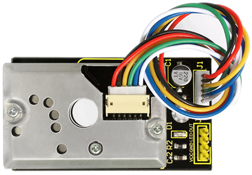
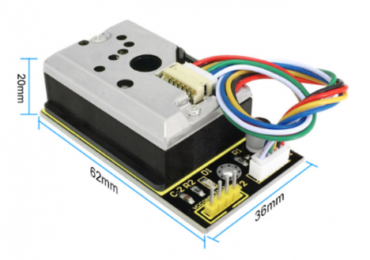
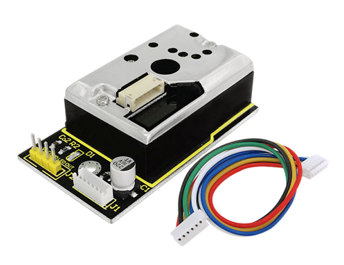
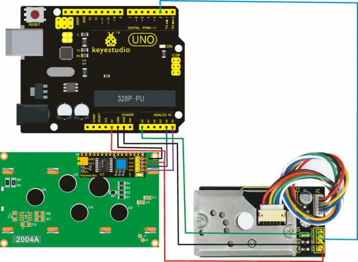
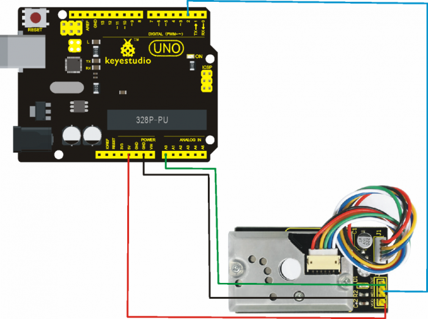
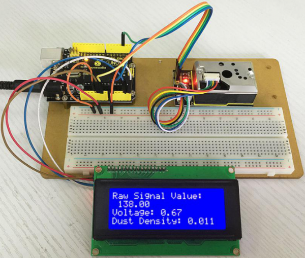
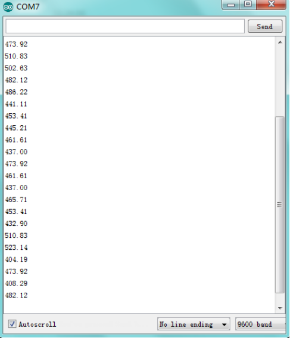

# KS0196 keyestudio PM2.5 Shield



## 1. Introduction

Keyestudio Dust sensor with Sharp GP2Y1014AU onboard works well in detecting very fine particle larger than 0.8μm in diameter, even like the cigarette smoke.

It also has an IR LED and photoeletric transistor. Arranging them with across corners can detect the reflected light of dust in the air.

Ultra-low power consumption(max at 20mA, typical at 11mA), analog voltage output is liner with dust density. It can be equipped with sensors up to 7V DC. The sensitivity is 0.5V/(0.1mg/m3).

## 2. Specification

- Power Voltage: 5-7V
- Working Temperature: -10℃ to 65 ℃
- Operating Current: 20mA (max)
- Detecting Value of Minimum Particle: 0.8μm
- Sensitivity: 0.5V/(0.1mg/m3)
- Voltage of Cleaning Air: 0.9V(typical)
- Storage Temperature: -20℃~80℃
- Life time: 5 Years
- Dimension: 62mm×36mm×20mm



## 3. Applications

- Air Purifier
- Air Conditioner
- Air Monitor
- PM2.5 Detector

## 4. Shipping List

- Dust Sensor x 1
- ZH1.5MM 6-pin wire x 1



## 5. How to Use

In case of working with a MCU:

- VCC --------- 3V-5V
- GND --------- GND
- LED --------- MCU IO (module driving pin)
- OUT --------- MCU IO (analog output)

## 6. Connection Diagram

**Project 1:**



**Project 2:**



## 7. Sample Code

**Library files and code download：** [Resources](./Resources.7z)

**Code for Project 1:**

```c
//pressing nothing to display value of analog revolving potentiometer
#include <Wire.h> 
#include <LiquidCrystal_I2C.h>
LiquidCrystal_I2C lcd(0x27,20,4);  // set the LCD address to 0x27 for a 16 chars and 2 line display
int measurePin = 0; //Connect dust sensor to Arduino A0 pin
int ledPower = 2;   //Connect 3 led driver pins of dust sensor to Arduino D2
int samplingTime = 280;
int deltaTime = 40;
int sleepTime = 9680;
float voMeasured = 0;
float calcVoltage = 0;
float dustDensity = 0;

void setup()
{
  lcd.init();                      // initialize the lcd 
  lcd.init();
  // Print a message to the LCD.
  lcd.backlight();
  lcd.setCursor(0,0);
  lcd.print("Raw Signal Value: ");
  lcd.setCursor(0,2);
  lcd.print("Voltage:");
  lcd.setCursor(0,3);
  lcd.print("Dust Density:");
  pinMode(ledPower,OUTPUT);
}

void loop()
{
  digitalWrite(ledPower,LOW); // power on the LED
  delayMicroseconds(samplingTime);
  voMeasured = analogRead(measurePin); // read the dust value
  delayMicroseconds(deltaTime);
  digitalWrite(ledPower,HIGH); // turn the LED off
  delayMicroseconds(sleepTime);
  // 0 - 5V mapped to 0 - 1023 integer values
  // recover voltage
  calcVoltage = voMeasured * (5.0 / 1024.0);
  // linear eqaution taken from http://www.howmuchsnow.com/arduino/airquality/
  // Chris Nafis (c) 2012
  dustDensity = 0.17 * calcVoltage - 0.1;
  lcd.setCursor(1,1);
  lcd.print(voMeasured);
  lcd.setCursor(9,2);
  lcd.print(calcVoltage);
  lcd.setCursor(14,3);
  lcd.print(dustDensity);
  delay(1000);
}

```

**Code for Project 2:**

```c
int dustPin=0;
float dustVal=0; 
int ledPower=2;
int delayTime=280;
int delayTime2=40;
float offTime=9680;

void setup()
{
    Serial.begin(9600);
    pinMode(ledPower,OUTPUT);
    pinMode(dustPin, INPUT);
}
 
void loop()
{
    // ledPower is any digital pin on the arduino connected to Pin 2 on the sensor
    digitalWrite(ledPower,LOW); 
    delayMicroseconds(delayTime);
    dustVal=analogRead(dustPin); 
    delayMicroseconds(delayTime2);
    digitalWrite(ledPower,HIGH); 
    delayMicroseconds(offTime);

    delay(1000);
    if (dustVal>36.455)
    Serial.println((float(dustVal/1024)-0.0356)*120000*0.035);
}
```

## 8. Result

**Result for Project 1:**



**Result of Project 2: open serial monitor to get the value shown below.**



**Data compared to air quality:**

- 3000 + = Very Bad
- 1050-3000 = Bad
- 300-1050 = Ordinary
- 150-300 = Good
- 75-150 = Very Good
- 0-75 = Tiptop